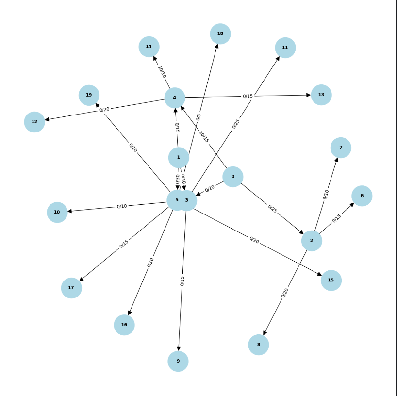

## Table of Contents

- [Task1](#task1)
- [Task2](#task2)


##Task1

Вхідні дані: 


*Схема логістичної мережі*


## Пропускна здатність маршрутів (одиниць)

| Від         | До          | Пропускна здатність (одиниць) |
|-------------|-------------|-------------------------------|
| Термінал 1  | Склад 1     | 25                            |
| Термінал 1  | Склад 2     | 20                            |
| Термінал 1  | Склад 3     | 15                            |
| Термінал 2  | Склад 3     | 15                            |
| Термінал 2  | Склад 4     | 30                            |
| Термінал 2  | Склад 2     | 10                            |
| Склад 1     | Магазин 1   | 15                            |
| Склад 1     | Магазин 2   | 10                            |
| Склад 1     | Магазин 3   | 20                            |
| Склад 2     | Магазин 4   | 15                            |
| Склад 2     | Магазин 5   | 10                            |
| Склад 2     | Магазин 6   | 25                            |
| Склад 3     | Магазин 7   | 20                            |
| Склад 3     | Магазин 8   | 15                            |
| Склад 3     | Магазин 9   | 10                            |
| Склад 4     | Магазин 10  | 20                            |
| Склад 4     | Магазин 11  | 10                            |
| Склад 4     | Магазин 12  | 15                            |
| Склад 4     | Магазин 13  | 5                             |
| Склад 4     | Магазин 14  | 10                            |


1. Вибір вершин та ребер.

Зважаючи на вхідні дані вершинами будемо вважати елементи логістичної мережі (термінали, склади та магазини). А ребрами - їх пропускну здатність.
Виходячи з цього побудовано матрицю пропускної здатності

```python    
capacity_matrix = [
        [0, 0, 25, 20, 15, 0, 0, 0, 0, 0, 0, 0, 0, 0, 0, 0, 0, 0, 0, 0],  # Термінал 1
        [0, 0, 0, 10, 15, 30, 0, 0, 0, 0, 0, 0, 0, 0, 0, 0, 0, 0, 0, 0],  # Термінал 2
        [0, 0, 0, 0, 0, 0, 15, 10, 20, 0, 0, 0, 0, 0, 0, 0, 0, 0, 0, 0],  # Склад 1
        [0, 0, 0, 0, 0, 0, 0, 0, 0, 15, 10, 25, 0, 0, 0, 0, 0, 0, 0, 0],  # Склад 2
        [0, 0, 0, 0, 0, 0, 0, 0, 0, 0, 0, 0, 20, 15, 10, 0, 0, 0, 0, 0],  # Склад 3
        [0, 0, 0, 0, 0, 0, 0, 0, 0, 0, 0, 0, 0, 0, 0, 20, 10, 15, 5, 10], # Склад 4
        [0, 0, 0, 0, 0, 0, 0, 0, 0, 0, 0, 0, 0, 0, 0, 0, 0, 0, 0, 0],     # Магазин 1
        [0, 0, 0, 0, 0, 0, 0, 0, 0, 0, 0, 0, 0, 0, 0, 0, 0, 0, 0, 0],     # Магазин 2
        [0, 0, 0, 0, 0, 0, 0, 0, 0, 0, 0, 0, 0, 0, 0, 0, 0, 0, 0, 0],     # Магазин 3
        [0, 0, 0, 0, 0, 0, 0, 0, 0, 0, 0, 0, 0, 0, 0, 0, 0, 0, 0, 0],     # Магазин 4
        [0, 0, 0, 0, 0, 0, 0, 0, 0, 0, 0, 0, 0, 0, 0, 0, 0, 0, 0, 0],     # Магазин 5
        [0, 0, 0, 0, 0, 0, 0, 0, 0, 0, 0, 0, 0, 0, 0, 0, 0, 0, 0, 0],     # Магазин 6
        [0, 0, 0, 0, 0, 0, 0, 0, 0, 0, 0, 0, 0, 0, 0, 0, 0, 0, 0, 0],     # Магазин 7
        [0, 0, 0, 0, 0, 0, 0, 0, 0, 0, 0, 0, 0, 0, 0, 0, 0, 0, 0, 0],     # Магазин 8
        [0, 0, 0, 0, 0, 0, 0, 0, 0, 0, 0, 0, 0, 0, 0, 0, 0, 0, 0, 0],     # Магазин 9
        [0, 0, 0, 0, 0, 0, 0, 0, 0, 0, 0, 0, 0, 0, 0, 0, 0, 0, 0, 0],     # Магазин 10
        [0, 0, 0, 0, 0, 0, 0, 0, 0, 0, 0, 0, 0, 0, 0, 0, 0, 0, 0, 0],     # Магазин 11
        [0, 0, 0, 0, 0, 0, 0, 0, 0, 0, 0, 0, 0, 0, 0, 0, 0, 0, 0, 0],     # Магазин 12
        [0, 0, 0, 0, 0, 0, 0, 0, 0, 0, 0, 0, 0, 0, 0, 0, 0, 0, 0, 0],     # Магазин 13
        [0, 0, 0, 0, 0, 0, 0, 0, 0, 0, 0, 0, 0, 0, 0, 0, 0, 0, 0, 0],     # Магазин 14
    ]
```

2. Покроковий розрахунок максимального потоку

  Для визначення максимального потоку в заданій логістичній мережі використовувався алгоритм Едмунда-Карпа.
Основною особливістю даного алгоритму є пошук в ширину (BFS), який дозволяє знаходити найкоротший маршрут від бажаного 
терміналу до окремого магазину.
  Як приклад для порівняння візьмемо 2 варіанти:
1 - коли є чіткий звязок Термінала з Магазином (наприклад, Термінал 1 та Магазин 9);
2 - коли звязку між Терміналом та Магазином немає (наприклад, Термінал 1 та Магазин 14).
  Як в 1, так і в 2 варіанті, самий алгоритм дій нічим не відріхняється, а ось вихідні результати дещо різняться.
Однак розпочнемо розрхунок максимального потоку та опис логіки дій саме для 1 варіанту:
  Алгоритм BFS завжди починає обрахунок від джерела (в даному випадку від Терміналу 1). На першому кроці ми додаємо 
до черги даний вузол і обходимо всіх його сусідніх вузлів і перевіряємо чи існує потенційний звязок (залишкова пропускна 
здатність) між Терміналом і сусіднім елементом (шлязом порівняння матриці пропускної здатності current_matrix з матрицею 
поточних потоків flow_matrix). Якщо звязок існує та ще не був відвіданий, то цей сусідній вузол 
додається в чергу для подальшого визначення всіх звязків як між поточним елементом і його сусідами так й їх дочірніми елементами.
Цей процес відбувається до того моменту, коли оброблятиметься цільовий елемент (Магазин 9) або якщо виконано перебір всіх елементів
логістичної схеми і не вдалося знайти цільовий еллемент (шляхів більше немає). Крім того проходячи через всю логістичну схему відбувається заповнення
списку батьківських елементів які мають залишкову пропускну здатність.
  Наступним кроком є знаходження мінімальної пропускної здатності логістичної мережі path_flow. Обчислення виконуються від цільового 
елемента (Магазин 9) і до джерела (Термінал 1). Використовуючи обчислений список батьківських елементів в поточній ітерації
визначаємо path_flow.
  Після визначення мінімальної пропускної здатності маршруту відбувається оновлення потоку вздовж шляху. Так само як і в попередньому
кроці алгоритм виконується від цільового елементу (Магазин 9) і до джерела (Термінал 1). Перш за все відбувається оновлення
матриці flow_matrix шляхом збільшення потоку для кожного ребра вздовж маршруту та зменшення потоку у зворотньому напрямку.
І на останок мінімальний потік path_flow додається до загального максимального потоку max_flow.
  Після цього відбувається наступна ітерація, але з врахуванням визначеної, в межах поточної ітерації, матриці фактичного потоку flow_matrix.
Даний цикл повторюється доти поки BFS не зможе знайти збільшуючий шлях, що означає, що мережа вичерпана.
  Для варіанту 1 максимальний потік становить 10, оскільки максимальний потік обмежений величиною пропускної здатності ребра від складу
3 до Магазину 9, що й становить 10.
  



*Граф-схема логістичної мережі(варіант 1)*

  Для варіанту 2 максимальний потік становитиме 0, оскільки не має фізичного звязку між Терміналом 1 та Магазином 14. Магазин 14 
звязаний тільки з Термінало 2. Що буде доведено нижче в ході експериментальних досліджень.


*Граф-схема логістичної мережі(варіант 2)*

В подальшому будемо розглядати тільки варіант 1.

3. Чи досягнуто оптимального потоку, і що це означає для розглянутої мережі?

  Алгоритм Едмондса-Карпа гарантує, що знайдений потік є оптимальним. Також у звязку з обмеження по пропускній здатності 'вузького місця', 
яке є ребро від Складу 3 до Магазину 9, величина якого становить 10, можна сказати, що для проведеного дослідження з заданими 
вхідними даними нам вдалося визначити оптимальний потік. 
  В аспекті даної задачі максимальне значення потоку 10 означає, що від Терміналу 1, через Склад 3 і до Магазину 9 ми можемо
максимально передати потік величиною 10. Якщо ж потрібно збільшити дане значення, то необхідно або збільшувати пропускну здатність
найвужчого місця (Склад 3 - Магазин 9), або побудувати новий шлях від інших складів.

4. Які термінали забезпечують найбільший потік товарів до магазинів?

  Для того щоб визначити найбільший потік від терміналів до магазинів перщ за все необхідно провести експериментільні дослідження
для визначення максимальних потоків від терміналів до всіх можливих магазинів. Нижче в таблиці наведено результати даного дослідження.


*Результати дослідження алгоритму Едмунда-Карпа про макиммальні потоки в логістичній мережі*

  Як видно з таблиці загальна сума максимальних потоків для Терміналу 1 становить суму максимальних потоків всіх фізичних
шляхів Магазин 1(15) + Магазин 2(10) + ... + Магазин 9 (10) = 135. Для терміналу 2 - 130. Однак зважаючи на обмеження по 
пропускних здатностях самих складів, то для Терміналу 1 - 60, а для терміналу 2 - 55. 
  Виходячи з цього можна сказати, що обидва термінали забезпечують оптимальні значення потоків, однак Термінал 1 є більш завантаженим
та забезпечує найбільше потоків товарів до магазинів. Однак варто зазначити, що Термінал 2 має можливість обслуговувати 11 магазинів,
в той час як Термінал 1 тільки 9.

5.  Які маршрути мають найменшу пропускну здатність і як це впливає на загальний потік?
  Виходячи з результатів дослідження видно, що найменшу пропускну здатність мають ті маршрути, які згідно вхідних даних мали вузькі місця,
тобто, найменшу пропускну здатність. До них відносяться Магазин 13 (максимальний потік 5). Також варто зазначити значну групу 
магазинів зі значенням максимального потоку 10 (Т1-М2, Т1-М5,Т2-М4,Т2-М5,Т2-М6,Т2-М9,Т2-М11,Т2-М14). Деякі з цих шляхів можна
оптимізувати, якщо використовувати інший термінал, наприклад, якщо використовувати шлях T1 - M4 через Склад 2 замість
Т2 - М4. Це може призвести до більш оптимальнішого максимального потоку, оскільки ребро від Терміналу 2 до Складу 2 має пропускну здатність
10, в той час, як для Терміналу 1 це значення складає 15.
  Маршрути з найменшою пропускною здатністю створюють вузьці місця, які задають затримки у використанні потенційної пропускної здатності.
Яскравим прикладом являється Склад 2 та маршрути, які зєднують його з термінало 1 та 2. Попит на товари у магазинів 4, 5 та 6 становить 
15, 10 та 25 відповідно. І якшо обрано марщрут від Терміналу 2, то це призведе до максиального потоку від складу до магазинів 10, тобто 
магазини недоотримають продукцію (магазини 4 та 6). В той час як маршрути від терміналу 1 дозволять обслуговувти практично повністю потреби
всіх, крім 6-го, магазинів. Тому вузькі місця мають значний вплив на загальний потік в даній логістичній мережі.


6. Які магазини отримали найменше товарів і чи можна збільшити їх постачання, збільшивши пропускну здатність певних маршрутів?
  Як зазначалось у відповіді на поперднє питання, найменше товарів отримують магазин 13 (5), а також ряд
магазинів, які мають маршрути з максимальним потоком 10. Для магазину 13 збільшення пропускної здатності можливе тільки при оптимізації 
звязку між складом 4 та самим магазином. Однак, покращення пропускної здатності можливе також в тому випадку, якщо задати більше
складів або змінити звязок даного магазину на інший склад. Даний варіант є можливий тільки якщо попит в магазині 13 збільшиться.
Однак, якщо попит залишатиметься на тому самому рівні, то й немає ніякої доцільності здійснювати додаткові кроки для покращення
пропускної здатності.
  Також варто зазначити що деякі магазини мають більший попит на товари ніж до них передаєтся, наприклад, магазини 6 та 7.
Максимальний потік для магазину 6 становить 15 (від Терміналу 1), в той час, як попит на продукцію складає 25, що призводить
до недоотримання товару магазином. Так само з магазином 7 - максимальний потік становить 15, а потреби 20. Для збільшення
пропускної здатності можна виконати ті самі кроки, що було зазначено вище для магазину 13. 

7. Чи є вузькі місця, які можна усунути для покращення ефективності логістичної мережі?
  Як зазначалось вище вузькі місця варто усувати за потреби. Тобто якшо Магазин 13 потребує більшої кількості товарів, то тоді 
є доцільність в усуненні даного вузького місця. Однак ситуація з магазинами 6 та 7 потребує покращення ефективності.
Для того щоб усунути вузькі місця можна виконати декілька дій. По-перше, це збільшити саму пропускну здатність вузьких місць (як 
з Магазином 13) шляхом модернізації логістичної структури. По-друге, це створення додаткових звязкув з іншими складами, що зменшить навантаження на 
вузькі ділянки. Також можна додати новий склад, який знизить залежність магазинів від інших складів. Наприклад, додати склад 5 і розділити навантаження
від магазинів зі складом 4.


##Task2

Згідно вхідних данх результати порівняння продуктивності B-tree та dict при виконанні діапазонних запиті мають наступні результати:


```bash
Total range_query time for OOBTree: 0.01882589999877382 seconds
Total range_query time for Dict: 3.02518549999877 seconds
```

  Як видно варіант з B-tree практично в 300 разів перевищує результати запитів для варіанту з dict.